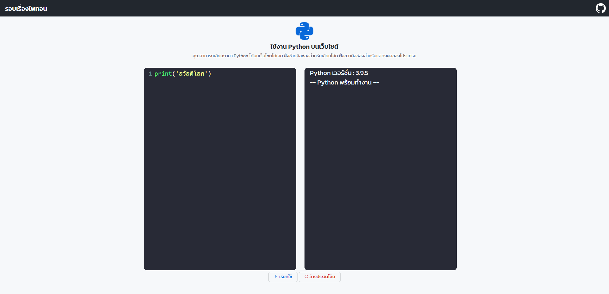

# Running Python in the Browser with WebAssembly

source: https://github.com/amirtds/python_editor_wasm

## Introduction

Python is a powerful programming language that can be used to write programs that run in the browser.

## Explore

https://python-editor-web.herokuapp.com/
